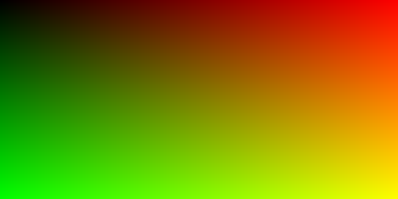

# Final Goal
The goal of this project is:

Build a ray tracer in Rust using the **wgpu** crate, and then improve the rendered output by applying a machine learning–based denoising model to clean up the final image.

# First Image

sin(y)blend.png)

